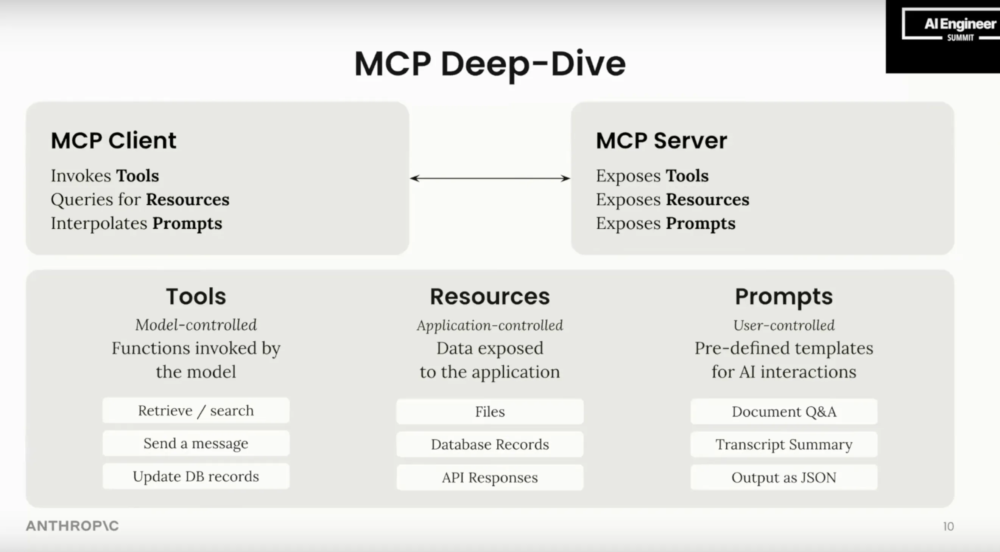
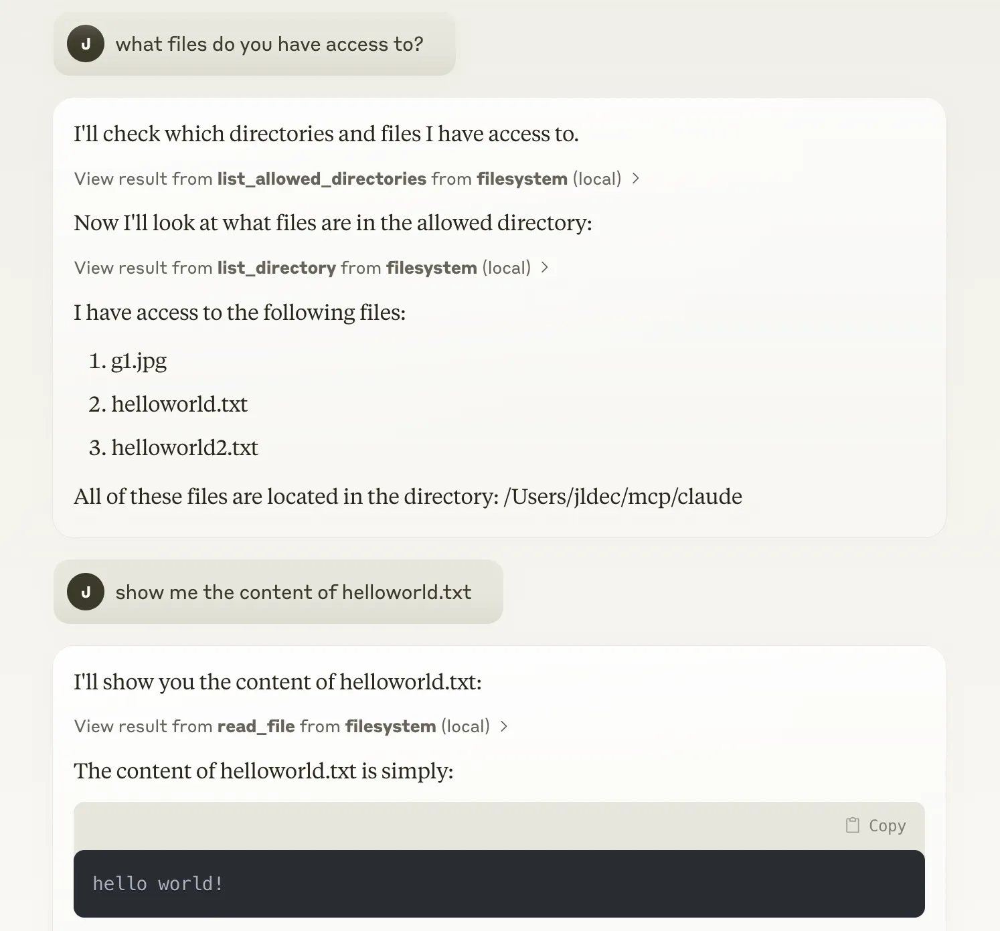
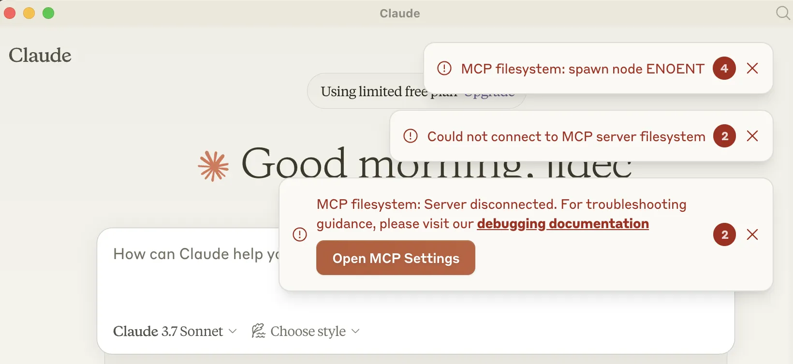

# Model Context Protocol (MCP)

MCP is a protocol for integrating AI applications with tools and external services. It was created by Anthropic as a way for [Claude](https://claude.ai/download) to access resources on the desktop, taking inspiration from [LSP](https://microsoft.github.io/language-server-protocol/) for editor extensions.

MCP servers can be coded do almost anything, including network calls to other services. This has led to MCP being talked about as a foundation for building AI agents, even though the original desktop-centric transport is far from the Web protocols you might expect.

What follows is very a quick overview of MCP. For deeper dives, I suggest:
1. [How MCP was born](https://www.youtube.com/watch?v=m2VqaNKstGc) interview with [@dsp_](https://x.com/dsp_) and [@jspahrsummers](https://x.com/jspahrsummers) - April 3 '25
2. [Workshop](https://www.youtube.com/watch?v=kQmXtrmQ5Zg) from the AI engineer summit - Feb '25
3. MCP [User guide](https://modelcontextprotocol.io)
4. MCP [Spec](https://spec.modelcontextprotocol.io/specification//2024-11-05/)
5. MCP [TypeScript SDK](https://github.com/modelcontextprotocol/typescript-sdk)
6. Example [MCP servers](https://github.com/modelcontextprotocol/servers)
7. Swyx's [spicy take](https://www.latent.space/p/why-mcp-won)



### How it works

To make a tool call, the [MCP client](https://modelcontextprotocol.io/clients) exchanges JSON-RPC messages with the [MCP server](https://modelcontextprotocol.io/examples).

A desktop client will spawn servers as subprocesses so that it can communicate with them over [stdio](https://spec.modelcontextprotocol.io/specification/2024-11-05/basic/transports/#stdio).

Besides [tool calls](https://spec.modelcontextprotocol.io/specification/2024-11-05/server/tools/), the protocol also supports:

- Server-to-client [notifications](https://spec.modelcontextprotocol.io/specification/2024-11-05/basic/messages/#notifications)
- URL-based [resources](https://spec.modelcontextprotocol.io/specification/2024-11-05/server/resources/) with subscriptions for change notifications
- Server-provided [Prompt templates](https://spec.modelcontextprotocol.io/specification/2024-11-05/server/prompts/)
- Nested LLM calls or [sampling](https://spec.modelcontextprotocol.io/specification/2024-11-05/client/sampling/)

There are [debugging](https://modelcontextprotocol.io/docs/tools/debugging) tools and [SDKs](https://modelcontextprotocol.io/sdk) for Python, Typescript, Java, and Kotlin.

### Why are people excited?

Talking to your own tools feels like magic.

Using MCP, AI appplications (clients) can connect to tools (servers) without custom integration.



[Here](https://www.youtube.com/watch?v=vGajZpl_9yA) is another example from Cloudflare.

<iframe width="560" height="315" src="https://www.youtube.com/embed/vGajZpl_9yA?start=61" title="YouTube video player" frameborder="0" allow="accelerometer; autoplay; clipboard-write; encrypted-media; gyroscope; picture-in-picture; web-share" referrerpolicy="strict-origin-when-cross-origin" allowfullscreen></iframe>

### What's next?
The buzz is real, but it's early days and AI agent platforms are just getting started.

- I'm optimistic for [HTTP](https://spec.modelcontextprotocol.io/specification/2024-11-05/basic/transports/#http-with-sse) to supplant stdio, especially with the [recent announcement](https://youtu.be/kQmXtrmQ5Zg?t=4409) of remote servers with auth.

  This is particularly important for scaling agents on the network and supporting multiple clients per server.

  _Update:_ See this [RFC](https://github.com/modelcontextprotocol/specification/pull/206) and [discussion](https://github.com/modelcontextprotocol/specification/discussions/102) for connectionless improvements to the HTTP transport. 🎉

- A [registry](https://youtu.be/kQmXtrmQ5Zg?t=4920) should accelerate the network effects of MCP, making servers and their capabilities more discoverable e.g. by other agents.

- [.well-known/mcp.json](https://youtu.be/kQmXtrmQ5Zg?t=5958) provides a way for agents to find AI interfaces on websites without the need for a central registry.

- [Stateless requests, streaming, and namespacing](https://youtu.be/kQmXtrmQ5Zg?t=6095) - all good things adopted from Web protocols.

### Growing pains

The way Claude Desktop spawns servers in subprocesses has resulted in a few [pitfalls](https://github.com/modelcontextprotocol/servers/issues/436#issuecomment-2564638983). I ran into this myself after configuring the filesystem server as described in the [quickstart](https://modelcontextprotocol.io/quickstart/user#2-add-the-filesystem-mcp-server).



The error stems from differences in the PATH when Claude Desktop spawns server subprocesses. One fix is to use absolute paths in `~/Library/Application Support/Claude/claude_desktop_config.json` on MacOS. E.g.

```json
{
  "mcpServers": {
    "filesystem": {
      "command": "/Users/jldec/n/bin/node",
      "args": [
        "/Users/jldec/mcp/servers/src/filesystem/dist/index.js",
        "/Users/jldec/mcp/claude"
      ]
    }
  }
}
```

# 🚀