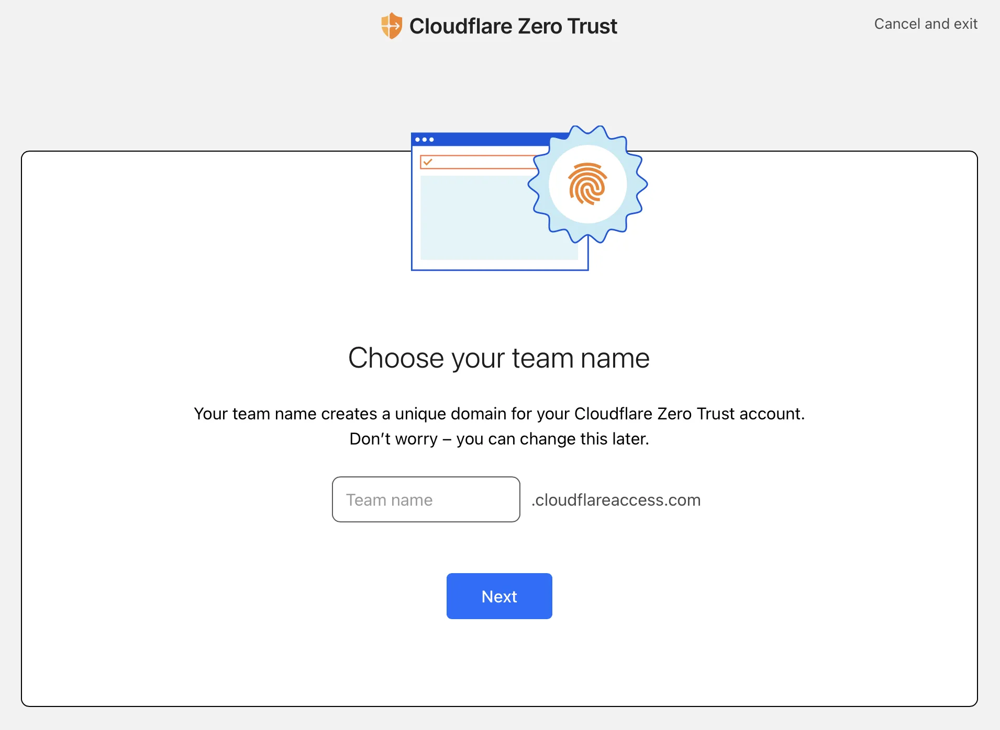
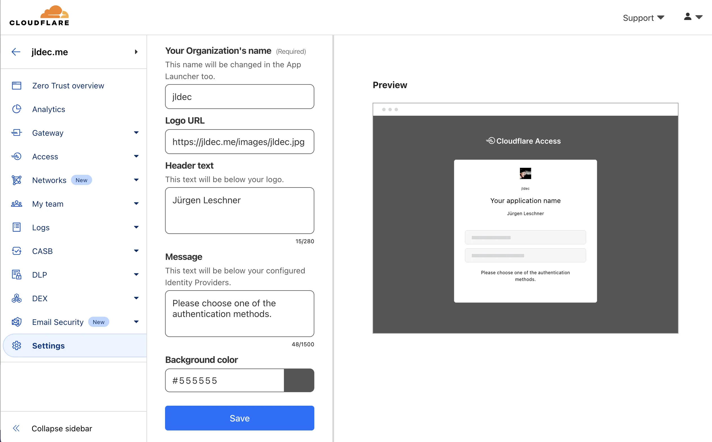
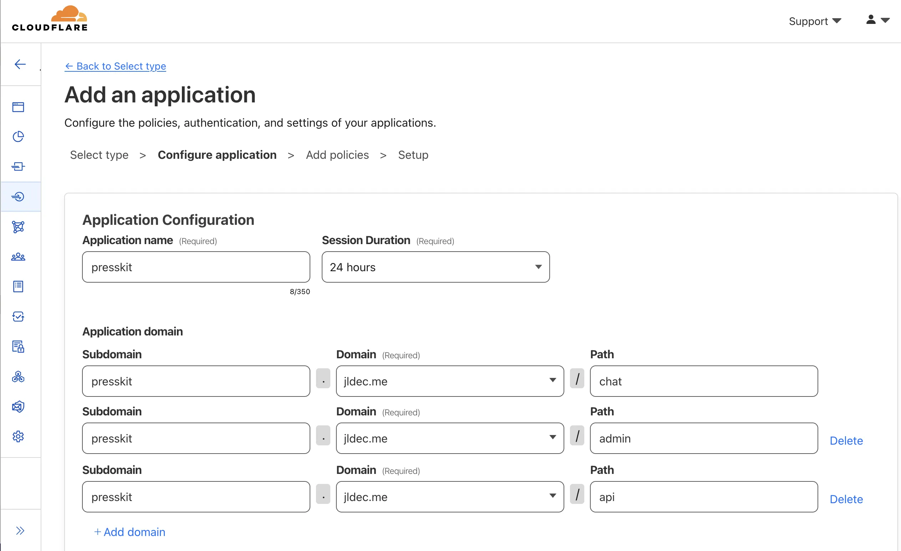
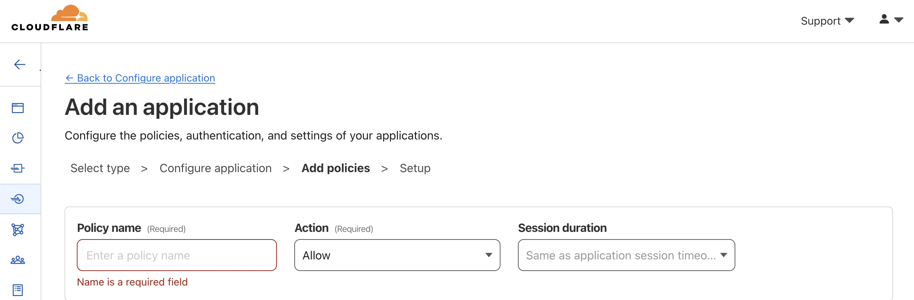
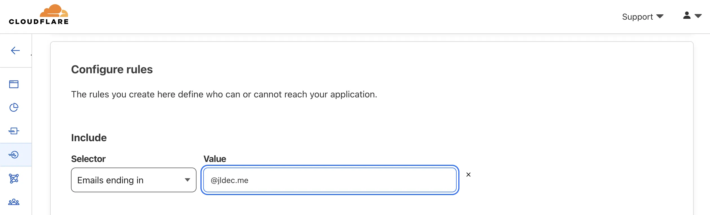
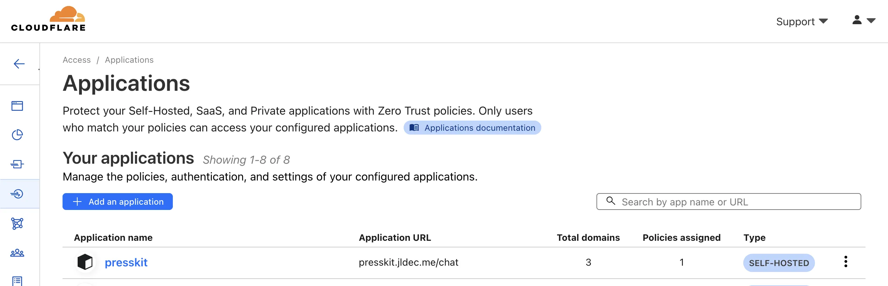
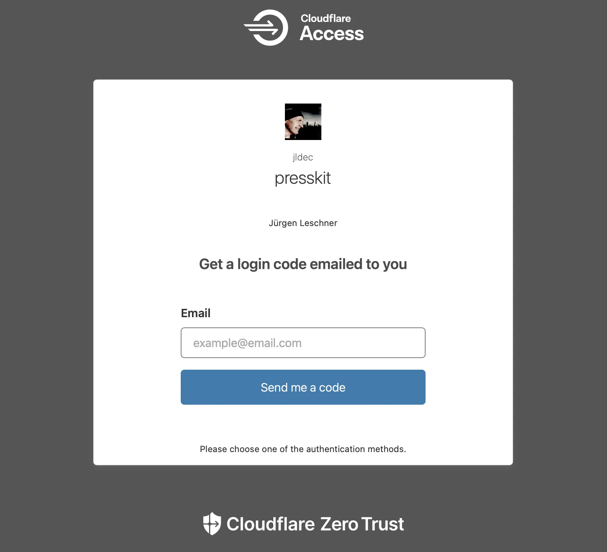
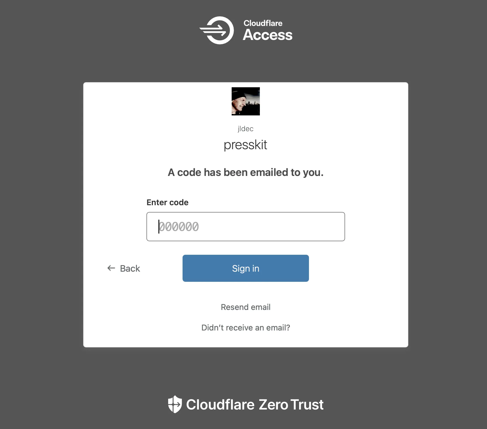
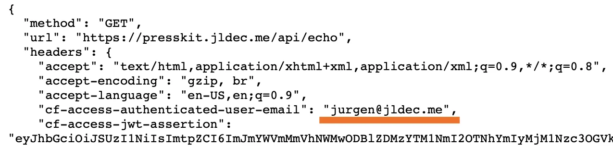

# No-code authentication with Cloudflare Zero Trust

Zero Trust is a convenient way to quickly add authentication to your site.

> This post covers:
  > 1. Configuring your Zero Trust account.
  > 2. Adding a new "application" for the protected routes on your site.
  > 3. Adding a policy to restrict access by email address.

**Caveats:** Your domain name has to be hosted by Cloudflare, and you will need to provide a credit card. The service is priced [per-seat](https://www.cloudflare.com/plans/zero-trust-services/), but if you expect less than 50 users, you can use it for free.

Zero Trust includes other services like [warp](https://developers.cloudflare.com/cloudflare-one/connections/connect-devices/warp/) and [tunnel](https://developers.cloudflare.com/cloudflare-one/connections/connect-networks/) and [gateway](https://developers.cloudflare.com/cloudflare-one/policies/gateway/). I'll talk more about those in future posts.

## Configure your Zero Trust account
The first time you open the Zero Trust [dashboard](https://dash.cloudflare.com/), you'll be prompted for a "team" name for the login URL at `<team-name>.cloudflareaccess.com`.

Choose a team name and then sign up for the free plan.

Next, customize your [login page](https://developers.cloudflare.com/cloudflare-one/applications/login-page/) under `Settings > Custom Pages`.

The login page will be shared across all sites protected by Zero Trust.

## Add a new application

Under `Access >  Applications`, click `Add Application` and select `Self Hosted`. Then configure the [paths](https://developers.cloudflare.com/cloudflare-one/policies/access/app-paths/) you want to protect.

Scrolling down to "Identity Providers" you should see `One-time PIN` is preconfigured. This is the simplest way to get started.

## Add a policy

The `Next` button will open another page to add a new [policy](https://developers.cloudflare.com/cloudflare-one/policies/access/). This restricts who can access the site.

Enter a policy name and then scroll down to `Configure Rules`. I configured the rule `Emails ending in`.

## Try it out

The remaining defaults are fine. After you click `Add application` you should see it in the applications list.

Point your browser to the URL you configured in the application. You should see the prompt to email a `One-time PIN`.

When you enter the PIN you should be authenticated, and allowed to access the site.

If your email address does not match the policy, you won't receive any email and will not be able to access the site.

### Next steps

If you prefer, you can replace the `One-time PIN` with another identity provider like [GitHub](https://developers.cloudflare.com/cloudflare-one/identity/idp-integration/github/) or [Google](https://developers.cloudflare.com/cloudflare-one/identity/idp-integration/google/) under `Settings > Authentication`.

Once users have been authenticated, you can use this information in your site by inspecting the `cf-access-authenticated-user-email` header or validating the [JWT token](https://developers.cloudflare.com/cloudflare-one/identity/authorization-cookie/validating-json) in the `cf-access-jwt-assertion` header.

---

> 💡💡
>
> It took longer to write this post than to configure auth for [jldec.me](https://jldec.me/).