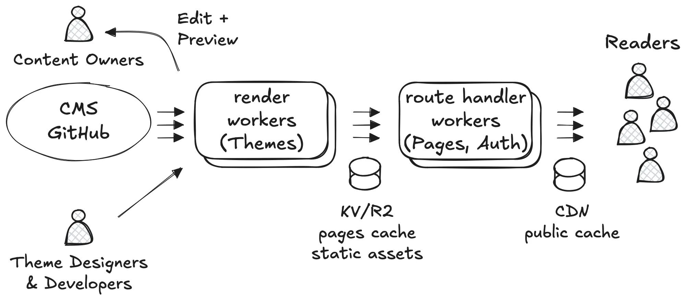

# On-demand rendering with Cloudflare Workers

### Content owners (bloggers)
- Register and configure their CMS and theme.
- Write content, upload images and videos.
- Preview, edit, approve, publish.

### Theme designers and developers
- Create beautiful, accessible themes.
- Develop updates with new features.
- Deploy Workers (code) and static assets (CSS, JS, images).

### Readers
- Register and login.
- Consume content.
- Receive notifications.
- Send feedback, comments.

