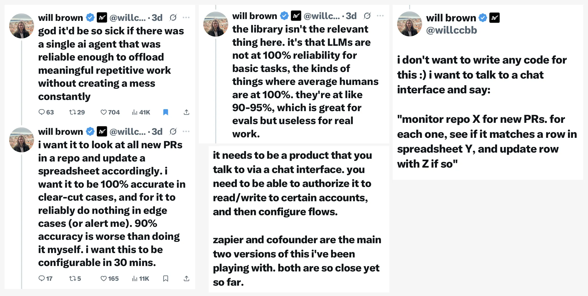

# Syncing GitHub PRs with a Google Sheet
This is a case study of using shell scripts and a Google Apps script to sync GitHub PRs with a Google sheet.
Code and installation instructions can be found in this GitHub [repo](https://github.com/jldec/google-sheet-pr-sync).

The idea came from this [tweet thread](https://x.com/willccbb/status/1968371980484460953) by @willccbb.


## Why?
Even though the thread above asks for a no-code pure AI Chat solution, quickly building a minimal AI-coded solution felt like the right place to start, helping to identify integration details, and assessing the complexity of the task.

All the shell scripts were developed with [Amp](https://ampcode.com/home) - threads [1](https://ampcode.com/threads/T-3cd81dfc-3569-4154-8b9e-7c89da9260cc), [2](https://ampcode.com/threads/T-9f0d37fd-68db-4828-814a-26b1095a0ad5), [3](https://ampcode.com/threads/T-5eccdc48-f5d2-48a8-969f-da184b540a42), [4](https://ampcode.com/threads/T-9fafe09f-9d85-4c01-af71-176c5c37b0a0), [5](https://ampcode.com/threads/T-77768cb7-df98-4b44-ac47-0eb2ed2d39c2).

The Google Apps script was developed with [Grok](https://grok.com/) - [thread](https://grok.com/c/fc1a62af-93a0-4b5c-a2ac-720adad7247b).

## How it works
Shell scripts [create-pr](https://github.com/jldec/google-sheet-pr-sync/blob/main/create-pr), [close-pr](https://github.com/jldec/google-sheet-pr-sync/blob/main/close-pr), and [list-prs](https://github.com/jldec/google-sheet-pr-sync/blob/main/list-prs) use git and the [gh CLI](https://cli.github.com/) to manipulate PRs from within the cloned repo directory. Only `list-prs` is required for syncing.

Calling [./sheet sync](https://github.com/jldec/google-sheet-pr-sync/blob/main/sheet) invokes `./list-prs --json` and pipes the JSON output into curl, which POSTs the data to the [Google Apps script](https://github.com/jldec/google-sheet-pr-sync/blob/main/google-apps-script.js) installed as a Web App on the Google sheet.

```sh
if [ "$1" = "sync" ]; then
    ./list-prs --json | curl -L -H "Content-Type: application/json" -d @- "$WEB_APP_URL"
```

The Apps script compares incoming PRs to existing rows in the sheet and syncs those which are new or changed.

## Takeaways
Connecting the output of the `gh` cli with a Google Apps script was straightforward, and required very little code to achieve solid results.

All the code was generated with AI in a matter of hours. Amp is excellent at iterating on a codebase inside a complete developer environment (IDE or terminal) with standard command line tools. Browser-based AI chat is better for research questions, or for generating code which can't be tested locally.

Technical and UX judgement were needed to guide the AI generating the code. E.g.

- How to create test PRs? A simple loop is prefered over invoking a more complex script multiple times concurrently and handling the conflicts with locking.

- How to sync with JSON? I chose to add rows and update cells incrementally, instead of overwriting the entire sheet.

- How to make the sync more robust? Don't assume column order, make case-insensitive column name matches.

- How to make fewer assumptions about the initial sheet? Support blank sheets.

These domain-specific decisions could be packaged into a new AI Tool for syncing JSON with Google sheets but are unlikely to exist in more generic integration tools.

### Amp suggestion
It would be awesome if Amp could organize threads by project, and auto-summarize all the interactions into a single document. Linking to Amp threads above required copy-pasting from https://ampcode.com/threads.

### Google Apps Scripts
Google Apps scripts are lightweight, mostly vanilla JavaScript, and quite productive, but they still feel like the dark ages after building with VS Code, Nodejs, and Cloudflare workers. No TypeScript, no Vite, no ESM modules, and git integration only possible via [clasp](https://developers.google.com/apps-script/guides/clasp).

### Future enhancement: Google Apps add-on
Publishing the Google Apps script as an [add-on](https://developers.google.com/workspace/add-ons/editors/sheets) would not only simplify installation, but the add on could include a sidebar UI, and the script could be extended to fetch JSON data from any HTTP api. This would enable users to configure and sync external data into their sheet with just a few clicks. 💥

## Next steps toward a low-code AI-chat solution
Here are some ideas for how to take this exercise forward.

1. Evaluate general-purpose MCP servers for GitHub PRs and Google sheets, and how to connect them. E.g. [1](https://workspacemcp.com/quick-start), [2](https://mcp.composio.dev/googlesheets), or [3](https://github.com/github/github-mcp-server).

2. Implement a custom MCP server specifically for JSON sync with Google sheets. Start by porting the Apps script in this repo to use the externally-accessible Google [sheets api](https://developers.google.com/workspace/sheets/api/guides/concepts).

3. Explore alternative low-code integration tools like Zapier and n8n. (See this [grok thread](https://grok.com/share/bGVnYWN5_be30da93-02e9-45ff-ad55-1031dbaab587).)

## 🚀🚀